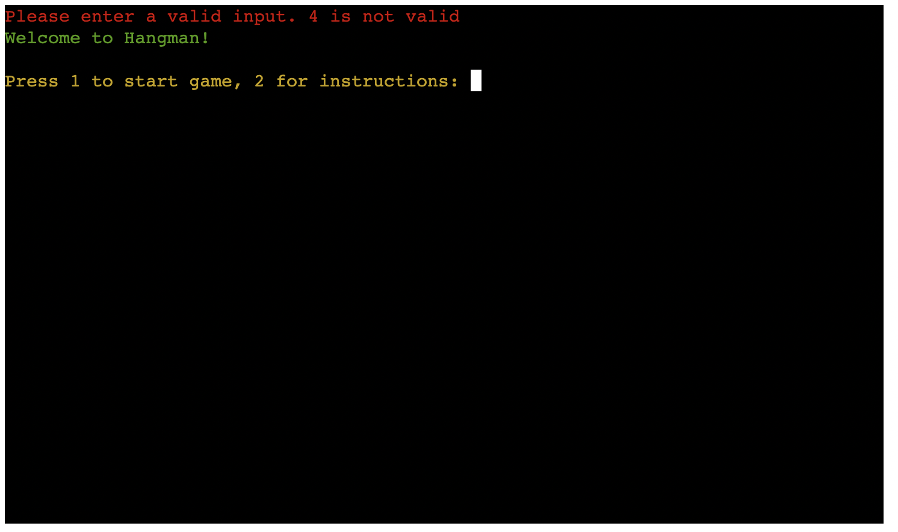
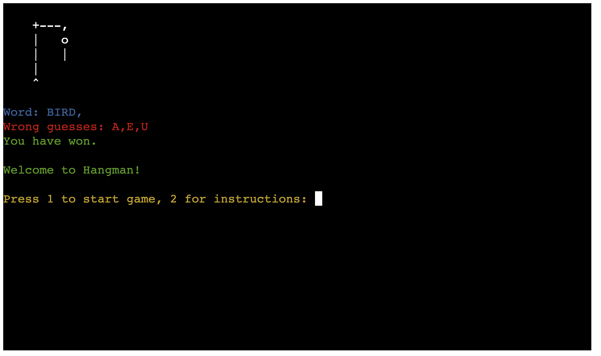
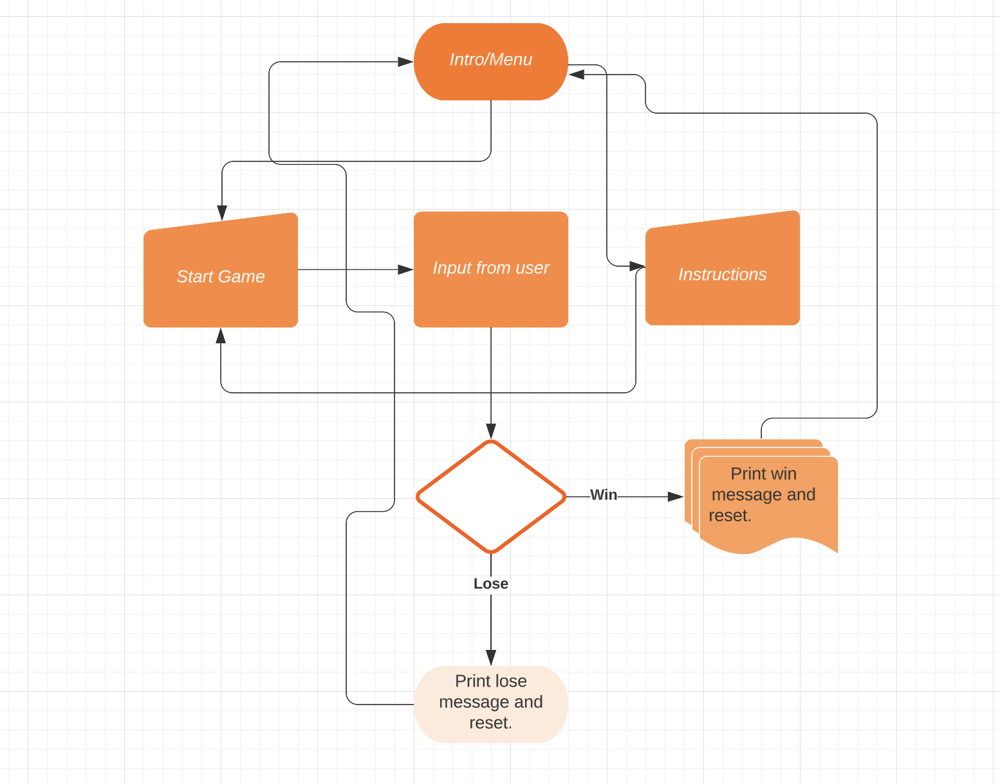

# HANGMAN GUESSING GAME

The Hangman Guessing Game is a game where the user tries to guess a hidden word one letter at a time. Each time they guess a successful letter it will appear in the terminal.

However if the user selects a wrong letter then a piece of the hangman will be added to the gallows. If the entire man is added to the gallows the user has lost, but if the guess the correct word before that they will win.

Either way the user can choose to play again and try to guess another word. 

## UX.

The game has a simple hangman design. The gallows are made from characters. The text has multiple colours with red for invalid inputs or wrong answers. Green, blue and cyan are used for more neutral text.

## User Stories

### New Site Users

- As a new site user, I would like to have an option to see instructions or start the game, so that I can choose to see how to play or start right away.
- As a new site user, I would like to see a clear error message, so that I can know that I entered the wrong input.
- As a new site user, I would like to see the gallows, so that I can see how many mistakes I've made.
- As a new site user, I would like to see wrong guesses, so that I can know which incorrect letters I have already chosen .
- As a new site user, I would like to see the word fill in when I guess the right letter, so that I can track my progress.
- As a new site user, I would like to see a win or lose message, so that I know if I guessed the right word or not.
- As a new site user, I would like to see an end screen, so that I can choose to play again or check the instructions.

## Features

### Existing Features

- **Menu #1**

    - The opening screen will display a menu feature that allows the user to either choose to read instructions or to start the game

- **Error message**

    - If the user inputs an invalid character the game will display an error message to let them know.

- **Win message #3**

    - If the user selects the correct letters they will see a win message. The user will also have the option to play again or see instructions.

- **Lose message #4**

    - If the user selects the wrong letters too many times they will get a lose message.However, they will also have the option to play again.

- **Wrong guess #4**

    - If the user enters the wrong letter they will know as the letter will be displayed in the wrong guess section.

### Future Features

- Score counter #1
    - In the future I would like to add a score counter so users can track their score.

## Tools & Technologies Used

- [Python](https://www.python.org) used as the back-end programming language.
- [Git](https://git-scm.com) used for version control. (`git add`, `git commit`, `git push`)
- [GitHub](https://github.com) used for secure online code storage.
- [GitHub Pages](https://pages.github.com) used for hosting the deployed front-end site.
- [Gitpod](https://gitpod.io) used as a cloud-based IDE for development.
- [Heroku](https://www.heroku.com) used for hosting the deployed back-end site.

## Data Model

### Flowchart

To follow best practice, a flowchart was created for the app's logic,
and mapped out before coding began using a free version of
[Lucidchart](https://www.lucidchart.com/pages/ER-diagram-symbols-and-meaning).

Below is the flowchart of the main process of this Python program. It shows the entire cycle of the program.

### Classes & Functions

The program uses classes as a blueprint for the project's objects (OOP). This allows for the object to be reusable.

The primary functions used on this application are:

- `intro()`
    - Shows a welcome message and options for the user.
- `instructions()`
    - Prints instructions for the user.
- `clear()`
    - Clear function to clean-up the terminal so things don't get messy.
- `get_mystery_word()`
    - Function to choose a random mystery word.
- `validate_letter()`
    - Function to ensure user enters a valide input.
- `start_game()`
    -  Function to run the game until the user has won or lost.
- `main()`
    - Run all program functions.

### Imports

I've used the following Python packages and/or external imported packages.

- `os`: used for adding a `clear()` function
- `colorama`: used for including color in the terminal
- `random`: used to get a random choice from a list

## Testing

For all testing, please refer to the [TESTING.md](TESTING.md) file.

## Deployment

Code Institute has provided a [template](https://github.com/Code-Institute-Org/python-essentials-template) to display the terminal view of this backend application in a modern web browser.
This is to improve the accessibility of the project to others.

The live deployed application can be found deployed on [Heroku](https://hangman-guessing-game.herokuapp.com).

### Heroku Deployment

This project uses [Heroku](https://www.heroku.com), a platform as a service (PaaS) that enables developers to build, run, and operate applications entirely in the cloud.

Deployment steps are as follows, after account setup:

- Select **New** in the top-right corner of your Heroku Dashboard, and select **Create new app** from the dropdown menu.
- Your app name must be unique, and then choose a region closest to you (EU or USA), and finally, select **Create App**.
- From the new app **Settings**, click **Reveal Config Vars**, and set the value of KEY to `PORT`, and the value to `8000` then select *add*.
- If using any confidential credentials, such as CREDS.JSON, then these should be pasted in the Config Variables as well.
- Further down, to support dependencies, select **Add Buildpack**.
- The order of the buildpacks is important, select `Python` first, then `Node.js` second. (if they are not in this order, you can drag them to rearrange them)

Heroku needs two additional files in order to deploy properly.
- requirements.txt
- Procfile

You can install this project's **requirements** (where applicable) using:
- `pip3 install -r requirements.txt`

If you have your own packages that have been installed, then the requirements file needs updated using:
- `pip3 freeze --local > requirements.txt`

The **Procfile** can be created with the following command:
- `echo web: node index.js > Procfile`

For Heroku deployment, follow these steps to connect your own GitHub repository to the newly created app:

Either:
- Select **Automatic Deployment** from the Heroku app.

Or:
- In the Terminal/CLI, connect to Heroku using this command: `heroku login -i`
- Set the remote for Heroku: `heroku git:remote -a app_name` (replace *app_name* with your app name)
- After performing the standard Git `add`, `commit`, and `push` to GitHub, you can now type:
	- `git push heroku main`

The frontend terminal should now be connected and deployed to Heroku!

### Local Deployment

This project can be cloned or forked in order to make a local copy on your own system.

For either method, you will need to install any applicable packages found within the *requirements.txt* file.
- `pip3 install -r requirements.txt`.

If using any confidential credentials, such as `CREDS.json` or `env.py` data, these will need to be manually added to your own newly created project as well.

#### Cloning

You can clone the repository by following these steps:

1. Go to the [GitHub repository](https://github.com/tpfk7/hangman-guessing-game) 
2. Locate the Code button above the list of files and click it 
3. Select if you prefer to clone using HTTPS, SSH, or GitHub CLI and click the copy button to copy the URL to your clipboard
4. Open Git Bash or Terminal
5. Change the current working directory to the one where you want the cloned directory
6. In your IDE Terminal, type the following command to clone my repository:
	- `git clone https://github.com/tpfk7/hangman-guessing-game.git`
7. Press Enter to create your local clone.

Alternatively, if using Gitpod, you can click below to create your own workspace using this repository.

Please note that in order to directly open the project in Gitpod, you need to have the browser extension installed.
A tutorial on how to do that can be found [here](https://www.gitpod.io/docs/configure/user-settings/browser-extension).

#### Forking

By forking the GitHub Repository, we make a copy of the original repository on our GitHub account to view and/or make changes without affecting the original owner's repository.
You can fork this repository by using the following steps:

1. Log in to GitHub and locate the [GitHub Repository](https://github.com/tpfk7/hangman-guessing-game)
2. At the top of the Repository (not top of page) just above the "Settings" Button on the menu, locate the "Fork" Button.
3. Once clicked, you should now have a copy of the original repository in your own GitHub account!

## Credits

I used a variety of YouTube tutorials to make the game. The links are linked below but the main video was https://www.youtube.com/watch?v=G0Cl_3rWmlI&ab_channel=PythonforEveryone.

### Content

| Source | Location | Notes |
| --- | --- | --- |
| [Markdown Builder](https://traveltimn.github.io/markdown-builder) | README and TESTING | tool to help generate the Markdown files |
| [Chris Beams](https://chris.beams.io/posts/git-commit) | version control | "How to Write a Git Commit Message" |
| [YouTube](https://www.youtube.com/watch?v=G0Cl_3rWmlI&ab_channel=PythonforEveryone) | entire game | template for full game |
| [YouTube](https://www.youtube.com/watch?v=u51Zjlnui4Y) | PP3 terminal | tutorial for adding color to the Python terminal |
| [YouTube](https://www.youtube.com/watch?v=m4nEnsavl6w&t=187s&ab_channel=Kite) | entire game | template for full game |
| [YouTube](https://www.youtube.com/watch?v=pFvSb7cb_Us&t=562s&ab_channel=ShaunHalverson) | entire game | template for full game |
| [YouTube](https://www.youtube.com/watch?v=5x6iAKdJB6U&t=60s&ab_channel=NeuralNine) | entire game | template for full game |

### Acknowledgements

- I would like to thank my Code Institute mentor, [Tim Nelson](https://github.com/TravelTimN) for their support throughout the development of this project.
- I would like to thank the [Code Institute](https://codeinstitute.net) tutor team for their assistance with troubleshooting and debugging some project issues.
- I would like to thank the [Code Institute Slack community](https://code-institute-room.slack.com) for the moral support; it kept me going during periods of self doubt and imposter syndrome.
- I would like to thank my Code Institute instructor, [Chris Quinn](https://github.com/10xoxr) for their support throughout the development of this project.

