# Testing

Return back to the [README.md](README.md) file.

## Code Validation

### Python

I have used the recommended [CI Python Linter](https://pep8ci.herokuapp.com) to validate all of my Python files.

| File | CI URL | Screenshot | Notes |
| --- | --- | --- | --- |
| run.py | [CI PEP8](https://pep8ci.herokuapp.com/https://raw.githubusercontent.com/tpfk7/hangman-guessing-game/main/run.py) | 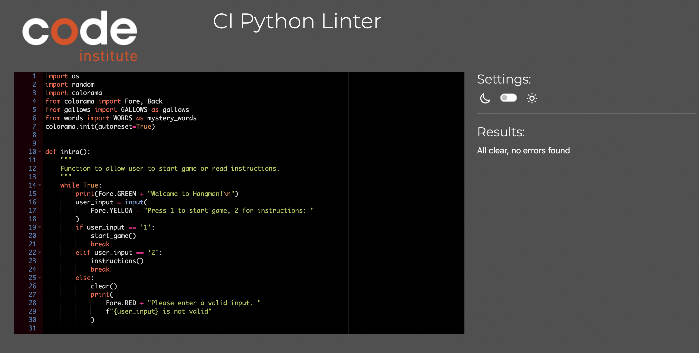 | Pass: No Errors|
| words.py | [CI PEP8](https://pep8ci.herokuapp.com/https://raw.githubusercontent.com/tpfk7/hangman-guessing-game/main/words.py) | 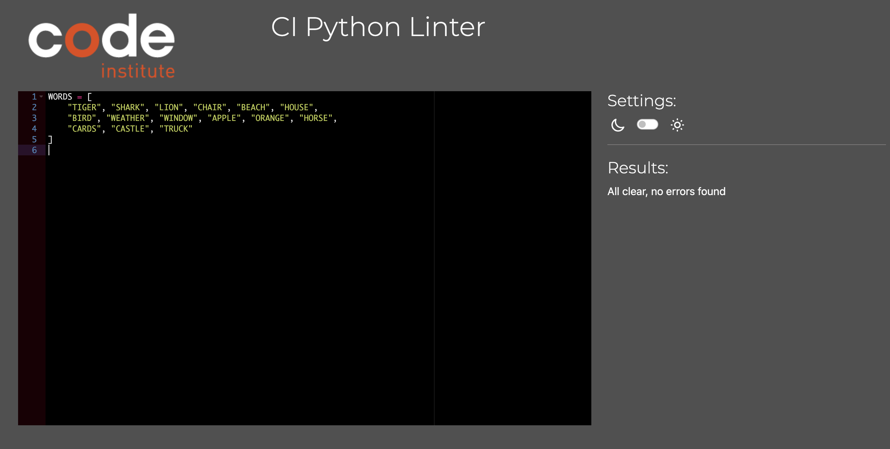 | Pass: No Errors |
| gallows.py | [CI PEP8](https://pep8ci.herokuapp.com/https://raw.githubusercontent.com/tpfk7/hangman-guessing-game/main/gallows.py) | 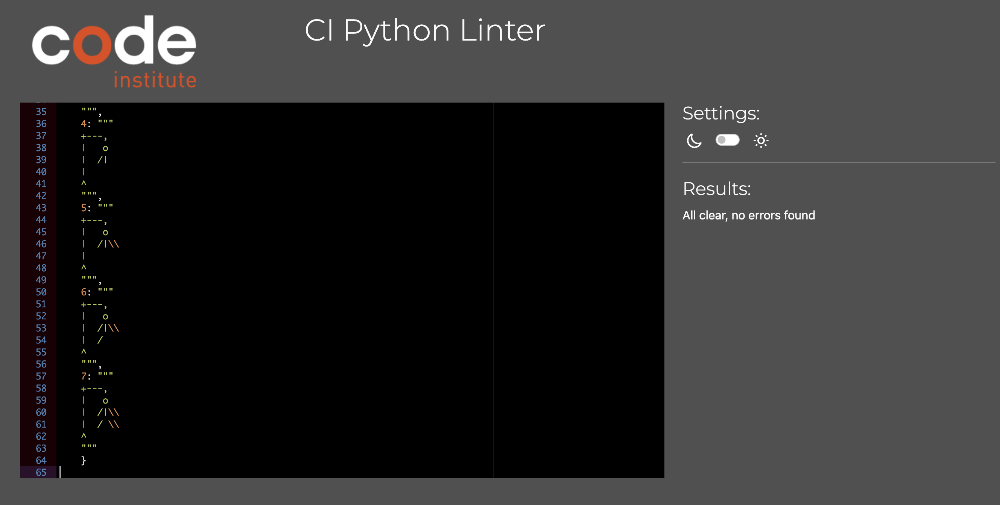 | Pass: No Errors |

## Lighthouse Audit

I've tested my deployed project using the Lighthouse Audit tool to check for any major issues.

| Page | Size | Screenshot | Notes |
| --- | --- | --- | --- |
| Home | Mobile | 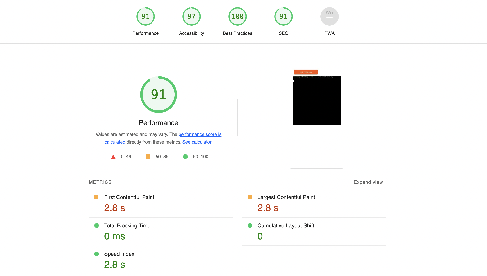 | Few warnings |
| Home | Desktop |  | Few warnings |
| Home | Tablet |  | Few warnings |

## Defensive Programming

Defensive programming was manually tested with the below user acceptance testing:

| Page | User Action | Expected Result | Pass/Fail | Screenshot |
| --- | --- | --- | --- | --- |
| Main Game Page | | | | |
| | Enter inncorrect number | Invalid input message | Pass |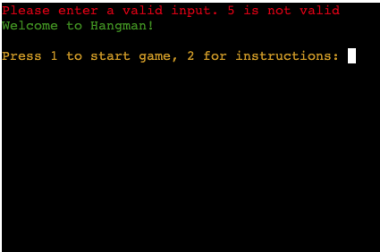  |
| | Enter a letter instead of a number | Invalid input message | Pass |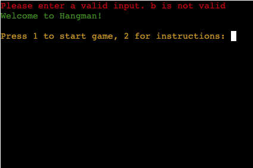 |
| | Hit enter without having a character | Invalid input message | Pass | |
| | Enter an invalid character e.g question mark | Invalid input message | Pass |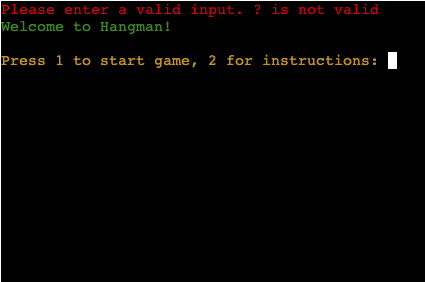 |
| | Enter a word instead of correct number | Invalid input message | Pass |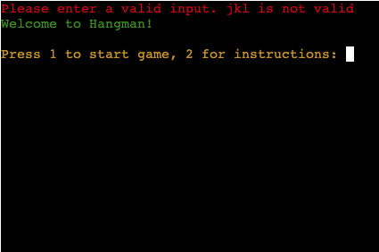 |
| | Enter multiple numbers instead of one| Invalid input message | Pass |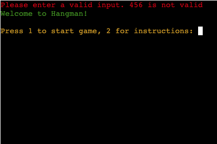 |
| Start Game Page | | | | |
| | Enter a number instead of letter | Invalid input message | Pass | |
| | Hit enter instead of typing a letter | Invalid input message | Pass | |
| | Type a word instead of a letter | Invalid input message | Pass | |
| | Type a character instead of a letter | Invalid input message | Pass | |
| | Type multiple letters instead of one | Invalid input message | Pass | |
| Instruction Game Page | | | | |
| | Enter a letter instead of a number | Invalid input message | Pass | |
| | Hit enter instead of typing a number | Invalid input message | Pass | |
| | Type a word instead of a number | Invalid input message | Pass | |
| | Type a character instead of a letter | Invalid input message | Pass | |
| | Type multiple numbers instead of one | Invalid input message | Pass | |
| End Game Page | | | | |
| | Enter a letter instead of a number | Invalid input message | Pass | |
| | Hit enter instead of typing a number | Invalid input message | Pass | |
| | Type a word instead of a number | Invalid input message | Pass | |
| | Type a character instead of a letter | Invalid input message | Pass | |
| | Type multiple numbers instead of one | Invalid input message | Pass | |

## User Story Testing

| User Story | Screenshot |
| --- | --- |
| As a new site user, I would like to have an option to see instructions or start the game, so that I can choose to see how to play or start right away. |  |
| As a new site user, I would like to to see a clear error message, so that I can know that I entered the wrong input. | 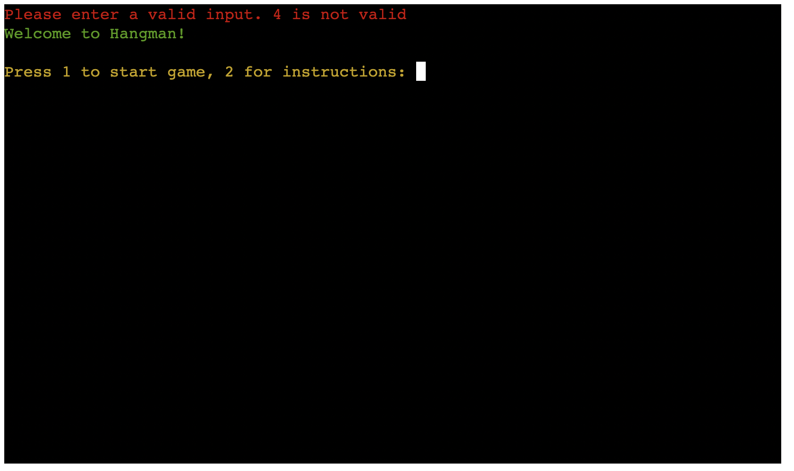 |
| As a new site user, I would like to I would like to see the gallows, so that I can see how many mistakes I've made. | 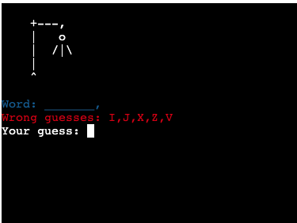 |
| As a new site user, I would like to I would like to see wrong guesses, so that I can know which incorrect letters I have already chosen . | 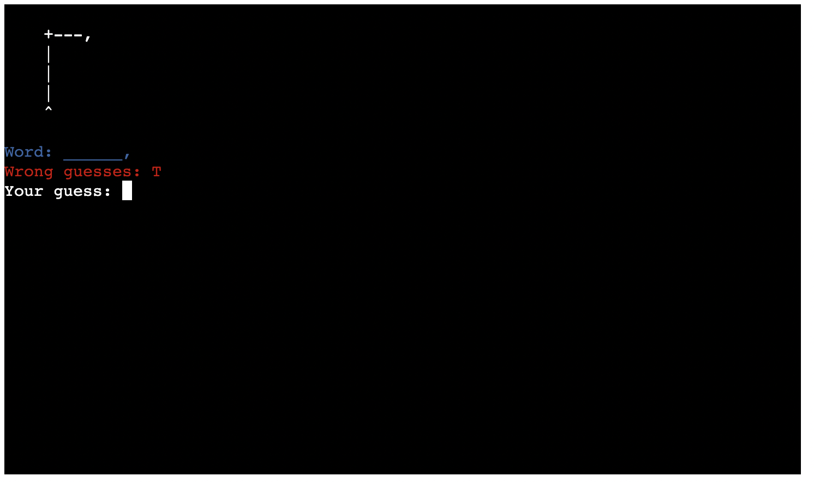 |
| As a new site user, I would like to see the word fill in when I guess the right letter, so that I can track my progress. | 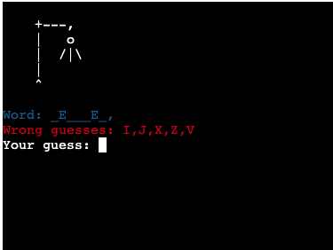 |
| As a new site user, I would like to I would like to see a win or lose message, so that I know if I guessed the right word or not. | 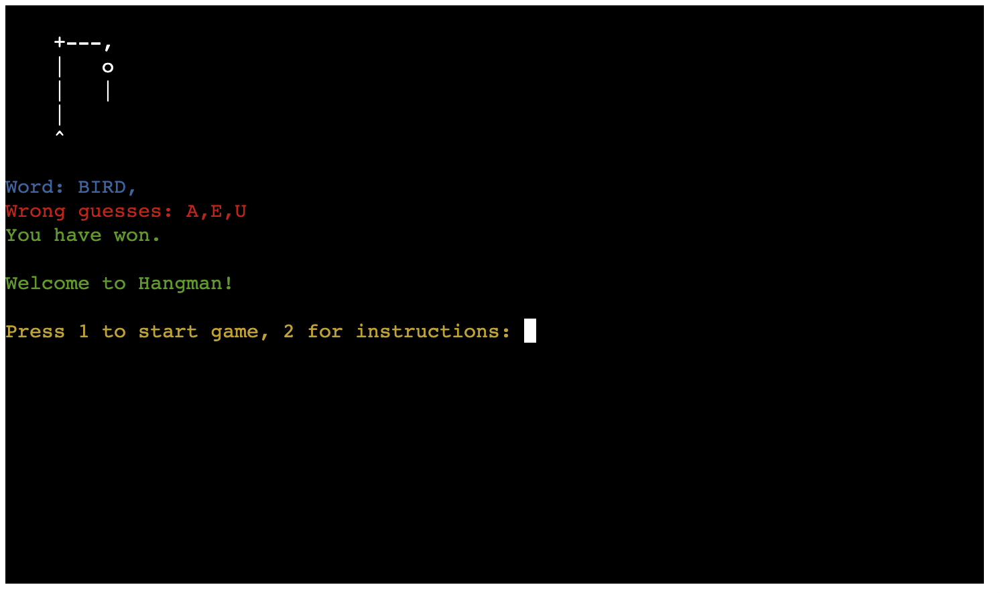 |
| As a new site user, I would like to be able to see an end screen, so that I can choose to play again or check the instructions. | 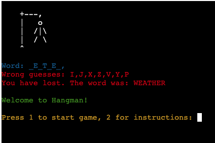 |

## Bugs

- The gallows change colour unexpectidly at the start of game.

    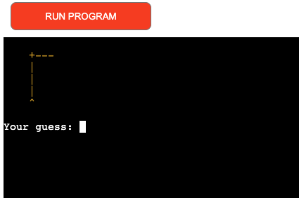

    - To fix this, I added another `Fore.WHITE` before the gallows.

- Incorrect numbers and characters are listed in wrong guesse.

    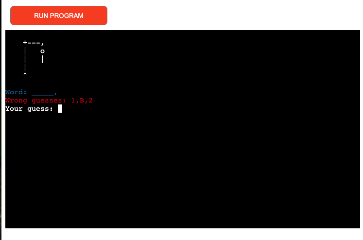

    - To fix this, I removed the recursive loop and replaced with an internal while loop.

## Unfixed Bugs

There are no remaining bugs that I am aware of.
