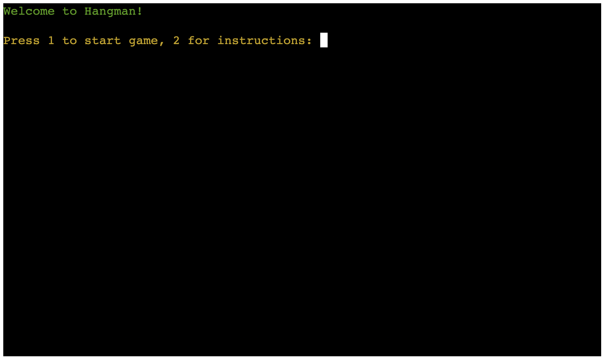

# Testing

Return back to the [README.md](README.md) file.

## Code Validation

### Python

I have used the recommended [CI Python Linter](https://pep8ci.herokuapp.com) to validate all of my Python files.

    | File | CI URL | Raw URL | Combined |
    | --- | --- | --- | --- |
    | PP3 *run.py* file | `https://pep8ci.herokuapp.com/` | `https://raw.githubusercontent.com/tpfk7/hangman-guessing-game/main/run.py` | https://pep8ci.herokuapp.com/https://raw.githubusercontent.com/tpfk7/hangman-guessing-game/main/run.py |
    | Boutique Ado *settings.py* | `https://pep8ci.herokuapp.com/` | `https://raw.githubusercontent.com/tpfk7/hangman-guessing-game/main/boutique_ado/settings.py` | https://pep8ci.herokuapp.com/https://raw.githubusercontent.com/tpfk7/hangman-guessing-game/main/boutique_ado/settings.py |

| File | CI URL | Screenshot | Notes |
| --- | --- | --- | --- |
| run.py | [CI PEP8](https://pep8ci.herokuapp.com/https://raw.githubusercontent.com/tpfk7/hangman-guessing-game/main/run.py) |  | Pass: No Errors|
| words.py | [CI PEP8](https://pep8ci.herokuapp.com/https://raw.githubusercontent.com/tpfk7/hangman-guessing-game/main/boutique-ado/settings.py) |  | Pass: No Errors |
| gallows.py | [CI PEP8](https://pep8ci.herokuapp.com/https://raw.githubusercontent.com/tpfk7/hangman-guessing-game/main/blog/views.py) |  | Pass: No Errors |

## Lighthouse Audit

I've tested my deployed project using the Lighthouse Audit tool to check for any major issues.

| Page | Size | Screenshot | Notes |
| --- | --- | --- | --- |
| Home | Mobile |  | Few warnings |
| Home | Desktop |  | Few warnings |
| Home | Tablet |  | Few warnings |

## Defensive Programming

Defensive programming was manually tested with the below user acceptance testing:

| Page | User Action | Expected Result | Pass/Fail | Comments |
| --- | --- | --- | --- | --- |
| Main Game Page | | | | |
| | Enter inncorrect number | Invalid input message | Pass | |
| | Enter a letter instead of a number | Invalid input message | Pass | |
| | Hit enter without having a character | Invalid input message | Pass | |
| | Enter an invalid character e.g question mark | Invalid input message | Pass | |
| | Enter a word instead of correct number | Invalid input message | Pass | |
| | Enter multiple numbers instead of one| Invalid input message | Pass | |
| Start Game Page | | | | |
| | Enter a number instead of letter | Invalid input message | Pass | |
| | Hit enter instead of typing a letter | Invalid input message | Pass | |
| | Type a word instead of a letter | Invalid input message | Pass | |
| | Type a character instead of a letter | Invalid input message | Pass | |
| | Type multiple letters instead of one | Invalid input message | Pass | |
| Instruction Game Page | | | | |
| | Enter a letter instead of a number | Invalid input message | Pass | |
| | Hit enter instead of typing a number | Invalid input message | Pass | |
| | Type a word instead of a number | Invalid input message | Pass | |
| | Type a character instead of a letter | Invalid input message | Pass | |
| | Type multiple numbers instead of one | Invalid input message | Pass | |
| End Game Page | | | | |
| | Enter a letter instead of a number | Invalid input message | Pass | |
| | Hit enter instead of typing a number | Invalid input message | Pass | |
| | Type a word instead of a number | Invalid input message | Pass | |
| | Type a character instead of a letter | Invalid input message | Pass | |
| | Type multiple numbers instead of one | Invalid input message | Pass | |

## User Story Testing

| User Story | Screenshot |
| --- | --- |
| As a new site user, I would like to have an option to see instructions or start the game, so that I can choose to see how to play or start right away. |  |
| As a new site user, I would like to to see a clear error message, so that I can know that I entered the wrong input. |  |
| As a new site user, I would like to I would like to see the gallows, so that I can see how many mistakes I've made. |  |
| As a new site user, I would like to I would like to see wrong guesses, so that I can know which incorrect letters I have already chosen . |  |
| As a new site user, I would like to see the word fill in when I guess the right letter, so that I can track my progress. |  |
| As a new site user, I would like to I would like to see a win or lose message, so that I know if I guessed the right word or not. |  |
| As a new site user, I would like to be able to see an end screen, so that I can choose to play again or check the instructions. |  |

## Bugs

⚠️⚠️⚠️⚠️⚠️ START OF NOTES (to be deleted) ⚠️⚠️⚠️⚠️⚠️

It's very important to document any bugs you've discovered while developing the project.
Make sure to include any necessary steps you've implemented to fix the bug(s) as well.

For JavaScript and Python applications, it's best to screenshot the errors to include them as well.

**PRO TIP**: screenshots of bugs are extremely helpful, and go a long way!

🛑🛑🛑🛑🛑 END OF NOTES (to be deleted) 🛑🛑🛑🛑🛑

- JS Uncaught ReferenceError: `foobar` is undefined/not defined

    

    - To fix this, I _____________________.

- JS `'let'` or `'const'` or `'template literal syntax'` or `'arrow function syntax (=>)'` is available in ES6 (use `'esversion: 11'`) or Mozilla JS extensions (use moz).

    

    - To fix this, I _____________________.

- Python `'ModuleNotFoundError'` when trying to import module from imported package

    

    - To fix this, I _____________________.

- Django `TemplateDoesNotExist` at /appname/path appname/template_name.html

    

    - To fix this, I _____________________.

- Python `E501 line too long` (93 > 79 characters)

    

    - To fix this, I _____________________.

### GitHub **Issues**

⚠️⚠️⚠️⚠️⚠️ START OF NOTES (to be deleted) ⚠️⚠️⚠️⚠️⚠️

An improved way to manage bugs is to use the built-in **Issues** tracker on your GitHub repository.
To access your Issues, click on the "Issues" tab at the top of your repository.
Alternatively, use this link: https://github.com/tpfk7/hangman-guessing-game/issues

If using the Issues tracker for your bug management, you can simplify the documentation process.
Issues allow you to directly paste screenshots into the issue without having to first save the screenshot locally,
then uploading into your project.

You can add labels to your issues (`bug`), assign yourself as the owner, and add comments/updates as you progress with fixing the issue(s).

Once you've sorted the issue, you should then "Close" it.

When showcasing your bug tracking for assessment, you can use the following format:

🛑🛑🛑🛑🛑 END OF NOTES (to be deleted) 🛑🛑🛑🛑🛑

**Fixed Bugs**

All previously closed/fixed bugs can be tracked [here](https://github.com/tpfk7/hangman-guessing-game/issues?q=is%3Aissue+is%3Aclosed).

| Bug | Status |
| --- | --- |
| [JS Uncaught ReferenceError: `foobar` is undefined/not defined](https://github.com/tpfk7/hangman-guessing-game/issues/1) | Closed |
| [Python `'ModuleNotFoundError'` when trying to import module from imported package](https://github.com/tpfk7/hangman-guessing-game/issues/2) | Closed |
| [Django `TemplateDoesNotExist` at /appname/path appname/template_name.html](https://github.com/tpfk7/hangman-guessing-game/issues/3) | Closed |

**Open Issues**

Any remaining open issues can be tracked [here](https://github.com/tpfk7/hangman-guessing-game/issues).

| Bug | Status |
| --- | --- |
| [JS `'let'` or `'const'` or `'template literal syntax'` or `'arrow function syntax (=>)'` is available in ES6 (use `'esversion: 11'`) or Mozilla JS extensions (use moz).](https://github.com/tpfk7/hangman-guessing-game/issues/4) | Open |
| [Python `E501 line too long` (93 > 79 characters)](https://github.com/tpfk7/hangman-guessing-game/issues/5) | Open |

## Unfixed Bugs

⚠️⚠️⚠️⚠️⚠️ START OF NOTES (to be deleted) ⚠️⚠️⚠️⚠️⚠️

You will need to mention unfixed bugs and why they were not fixed.
This section should include shortcomings of the frameworks or technologies used.
Although time can be a big variable to consider, paucity of time and difficulty understanding
implementation is not a valid reason to leave bugs unfixed.

If you've identified any unfixed bugs, no matter how small, be sure to list them here.
It's better to be honest and list them, because if it's not documented and an assessor finds the issue,
they need to know whether or not you're aware of them as well, and why you've not corrected/fixed them.

Some examples:

🛑🛑🛑🛑🛑 END OF NOTES (to be deleted) 🛑🛑🛑🛑🛑

- On devices smaller than 375px, the page starts to have `overflow-x` scrolling.

    

    - Attempted fix: I tried to add additional media queries to handle this, but things started becoming too small to read.

- For PP3, when using a helper `clear()` function, any text above the height of the terminal does not clear, and remains when you scroll up.

    

    - Attempted fix: I tried to adjust the terminal size, but it only resizes the actual terminal, not the allowable area for text.

- When validating HTML with a semantic `section` element, the validator warns about lacking a header `h2-h6`. This is acceptable.

    

    - Attempted fix: this is a known warning and acceptable, and my section doesn't require a header since it's dynamically added via JS.

⚠️⚠️⚠️⚠️⚠️ START OF NOTES (to be deleted) ⚠️⚠️⚠️⚠️⚠️

If you legitimately cannot find any unfixed bugs or warnings, then use the following sentence:

🛑🛑🛑🛑🛑 END OF NOTES (to be deleted) 🛑🛑🛑🛑🛑

There are no remaining bugs that I am aware of.
